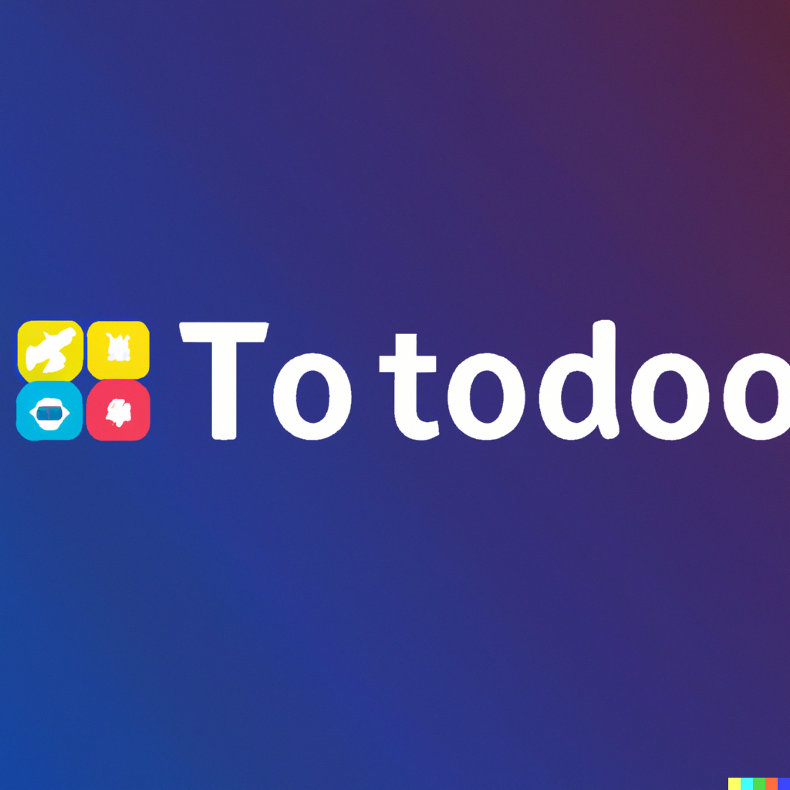

  

# To-todoo api 📝

To start your Phoenix server:

-   Run mix setup to install and setup dependencies from apps
-   Start Phoenix endpoint with mix phx.server

-   Check health of database by `localhost:4000/health`

## Learn more

-   Official website: https://www.phoenixframework.org/
-   Guides: https://hexdocs.pm/phoenix/overview.html
-   Docs: https://hexdocs.pm/phoenix
-   Forum: https://elixirforum.com/c/phoenix-forum
-   Source: https://github.com/phoenixframework/phoenix
